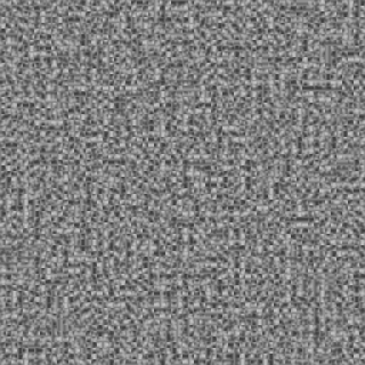

## Images generated due to bugs

awesome-but-wrong

cow-error

cute-little-errors

fish

g0

g00-x

g11-x

gradient-contribution-error

gradient-index-error

inverted-blending-error

n00

n01

n10

n11

overflow-error

perlin

probably-blend-weight-error

puzzle-error

resolution-error

very-pretty-error

## Varying blend functions

perlin-p1

perlin-p3

perlin-p5

perlin-p7

perlin-random-gradients-blend-p3

perlin-random-gradients-blend-p5

perlin-random-gradients-blend-p7

## Varying number of simplex gradients

simplex-2-gradients

simplex-4-gradients

simplex-8-gradients

simplex-16-gradients

simplex-32-gradients

simplex-64-gradients

simplex-128-gradients

simplex-256-gradients

## Simplex weights

simplex weights

